# Deploying LAMP stack using vagrant VMs

## Setup machines in [Vagrantfile](/Vagrantfile)
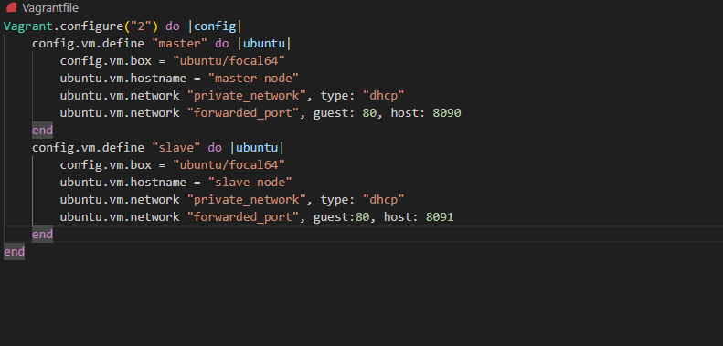

## Provision VMs

`vagrant up`
 
## Get machines IP addresses

`ip addr`

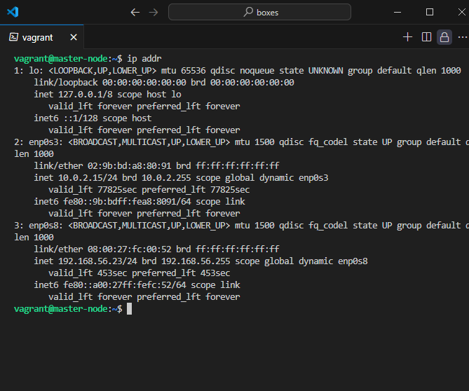
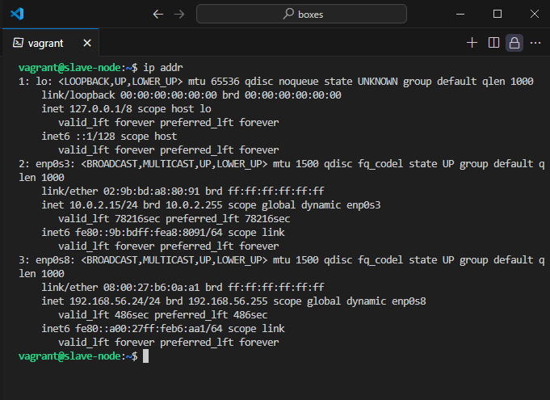

```
Master: 192.168.56.23
Slave: 192.168.56.24
```

## Run [Deployment Bashscript](screenshot/deploymaster.png)

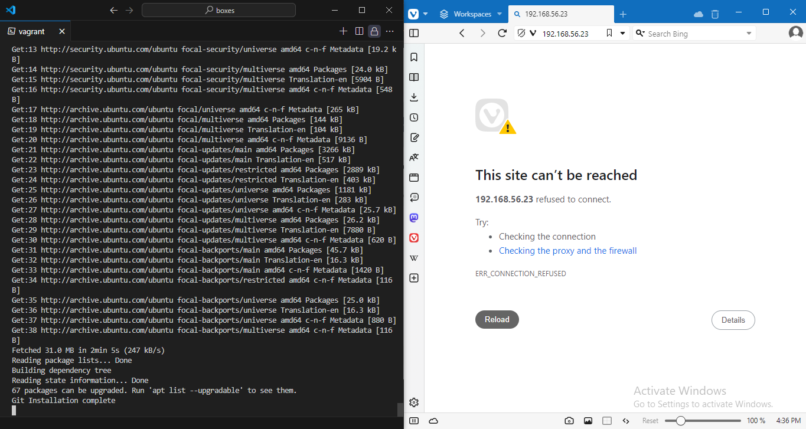

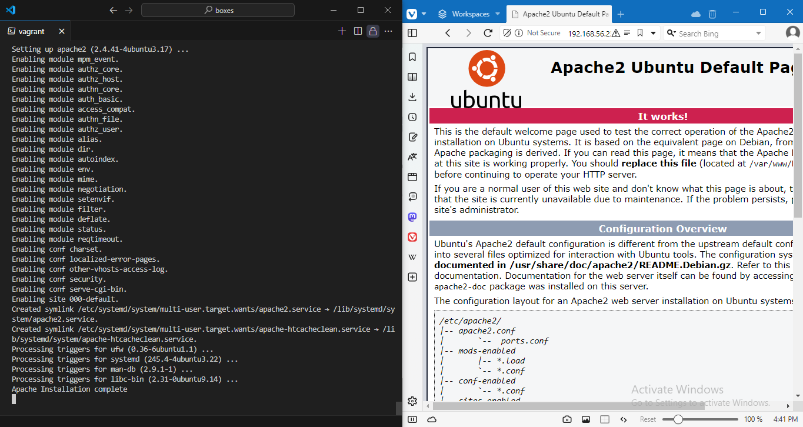

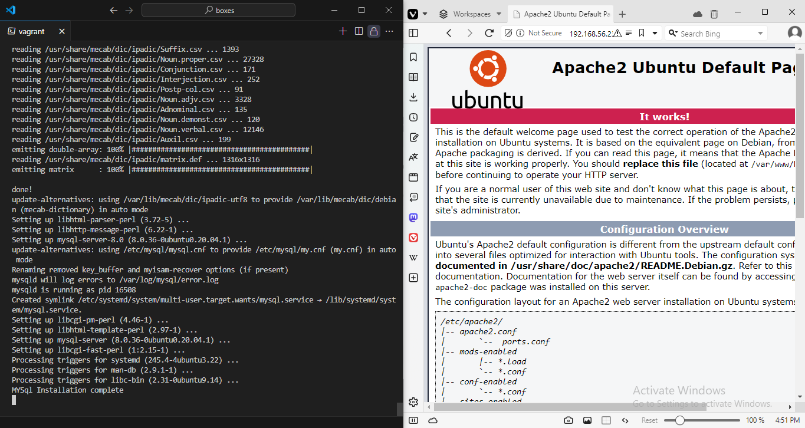

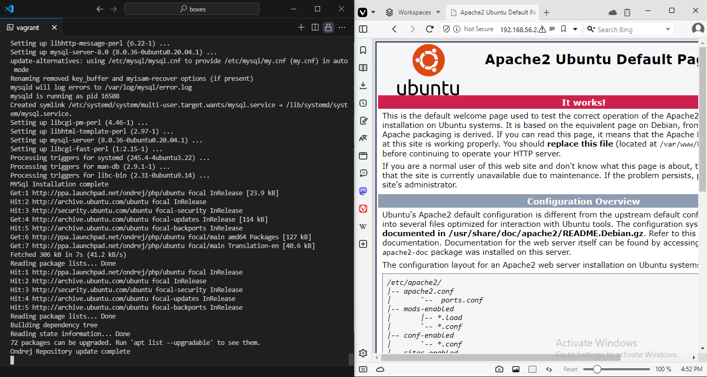

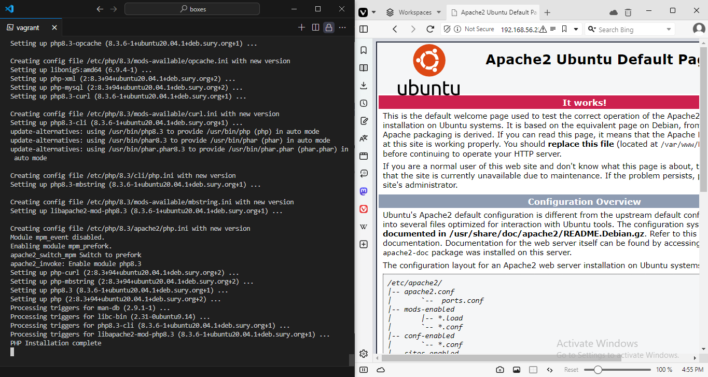

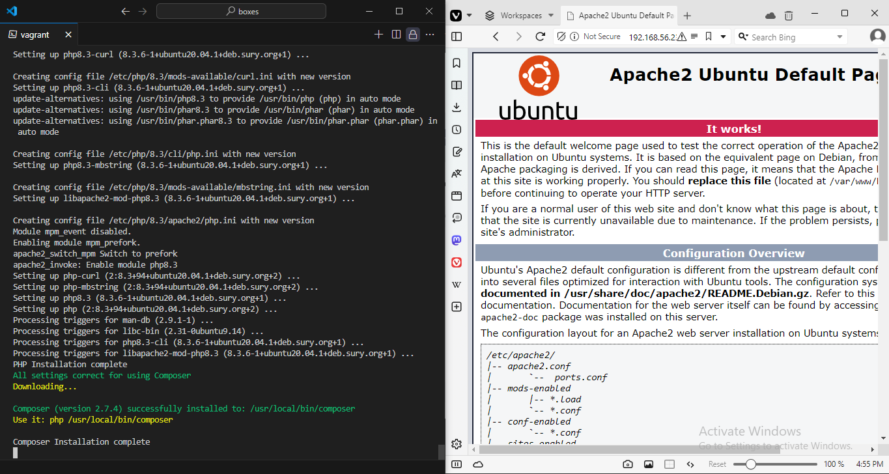

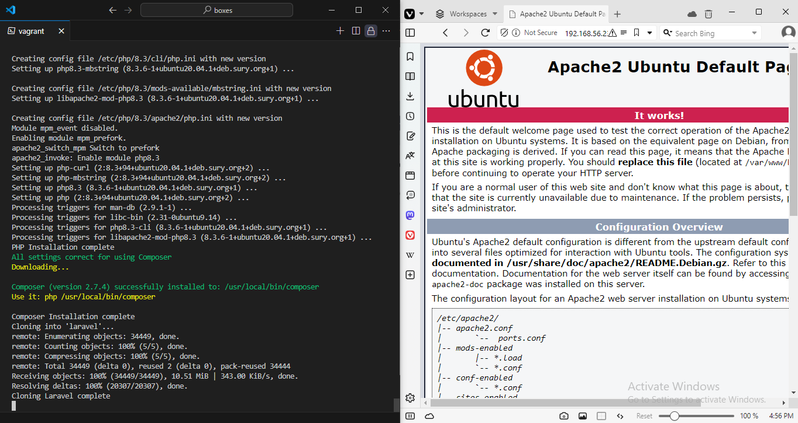

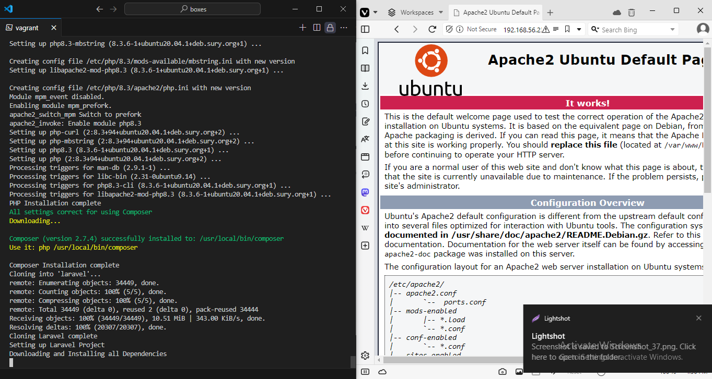

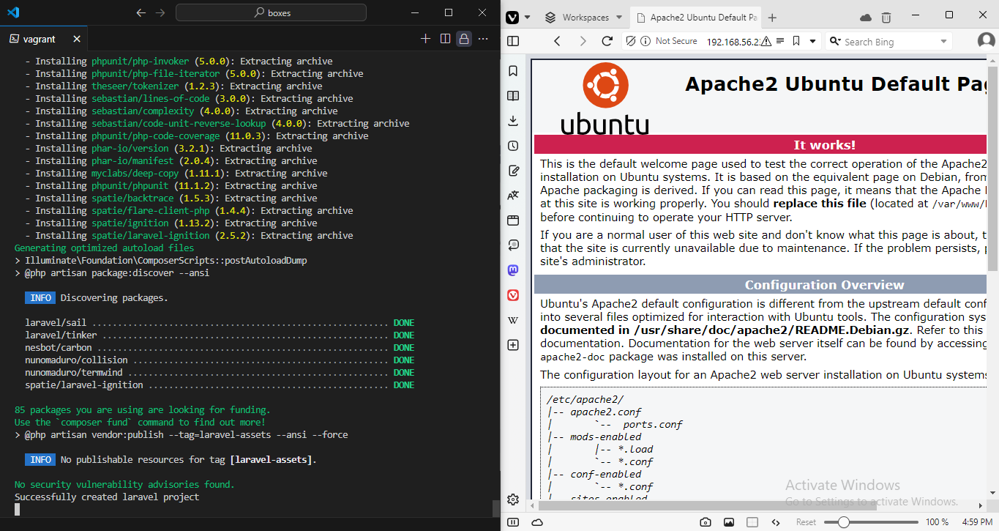

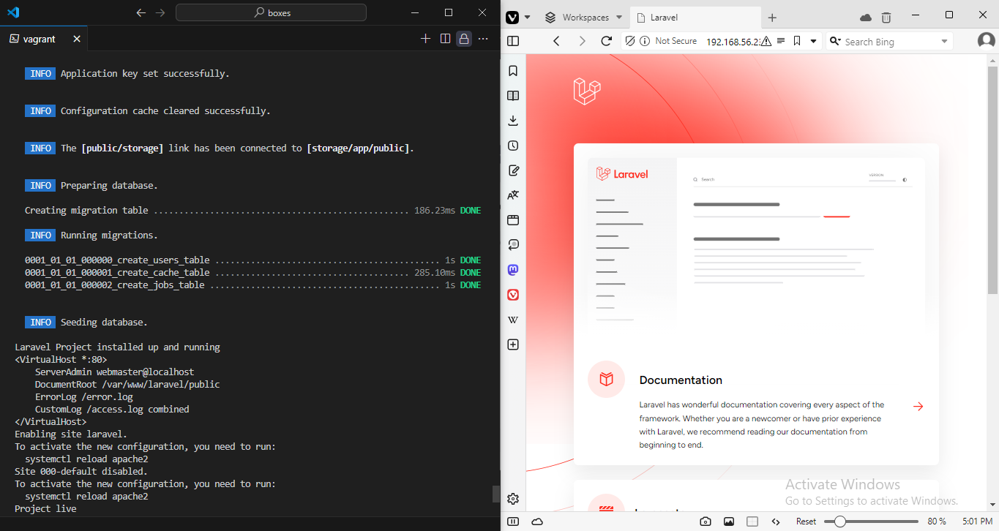


## Install ansible on master, setup [hosts](/hosts) file and test connection

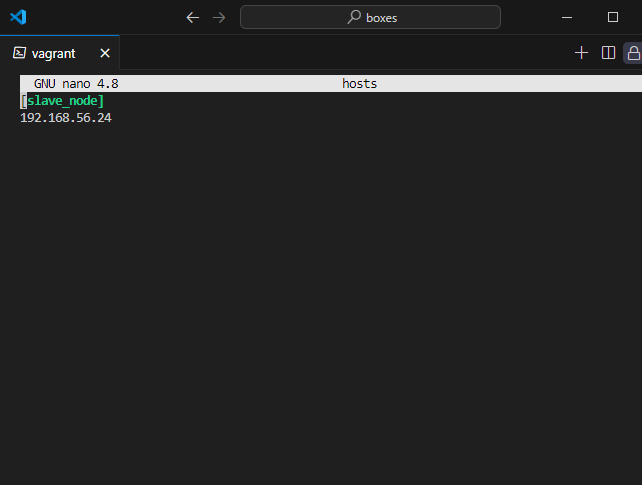

`ansible all -m ping`

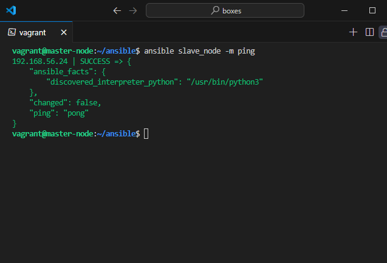

## Create [Ansible Playbook](./lamp.yaml)


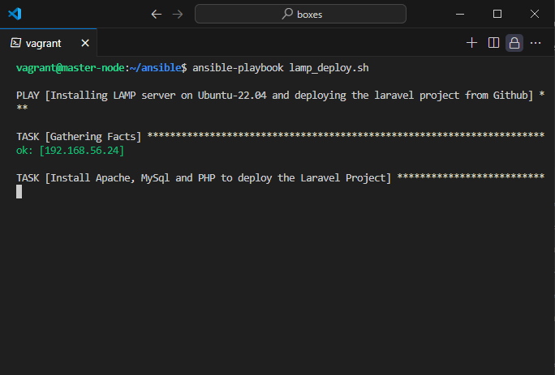


